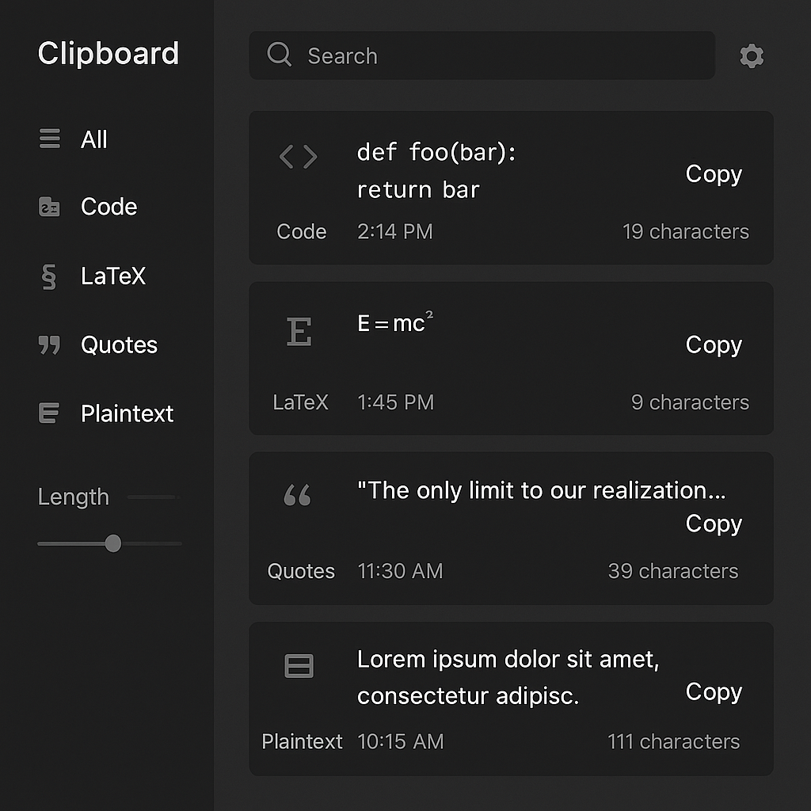

# ClipBoard

*The one-stop shop for everything copy-paste.*
Developed by CSC572: The Open Source Movement, Spring 2024-2025

## Brief Description

ClipBoard records everything copied to the system clipboard and aims to intelligently organize it into categories like code snippets, quotes, math equations, URLs, or plain text. Users can search past entries via tags, date, or keywords, making it easy to find what they copied days or weeks ago.

UI Display:


### Instructions to download for users

Dependencies:
- pyperclip
- PyQt5

Install dependencies with:

###  ```pip install -r requirements.txt``` or ```pip3 install -r requirements.txt```

Open application using

### ```python backgroundapp.py```

### Contributing to Spotify Analyzer

You can start editing the ClipBoard by modifying backgroundapp.py. In order to view your changes, you must close and reopen the Python application ClipBoard is running on. 

### Expectations for Contributions

- Use a forked repository and pull requests to propose changes.
- Follow the project's coding style and conventions.
- Write clear and concise commit messages.
- Ensure that your code is well-documented.

### Potential Contribution

- Generate tags for each entry based on the content
- Special shortcut for non-tracking copy-paste (cmd+shift+c)
- Address any known issues

### Known Issues

- Copy button doesn't switch to Copied when completed
- Blocks of copy-paste history are super large and clog up the window too much (should be condensed)
- Categorization logic doesn't work well

### License

Copyright 2025 CSC572 Spring 2025

Permission is hereby granted, free of charge, to any person obtaining a copy
of this software and associated documentation files (the “Software”), to deal
in the Software without restriction, including without limitation the rights
to use, copy, modify, merge, publish, distribute, sublicense, and/or sell
copies of the Software, and to permit persons to whom the Software is furnished
to do so, subject to the following conditions:

The above copyright notice and this permission notice shall be included in all
copies or substantial portions of the Software.

THE SOFTWARE IS PROVIDED “AS IS”, WITHOUT WARRANTY OF ANY KIND, EXPRESS OR
IMPLIED, INCLUDING BUT NOT LIMITED TO THE WARRANTIES OF MERCHANTABILITY, FITNESS
FOR A PARTICULAR PURPOSE AND NONINFRINGEMENT. IN NO EVENT SHALL THE AUTHORS OR
COPYRIGHT HOLDERS BE LIABLE FOR ANY CLAIM, DAMAGES OR OTHER LIABILITY, WHETHER
IN AN ACTION OF CONTRACT, TORT OR OTHERWISE, ARISING FROM, OUT OF OR IN CONNECTION
WITH THE SOFTWARE OR THE USE OR OTHER DEALINGS IN THE SOFTWARE.
